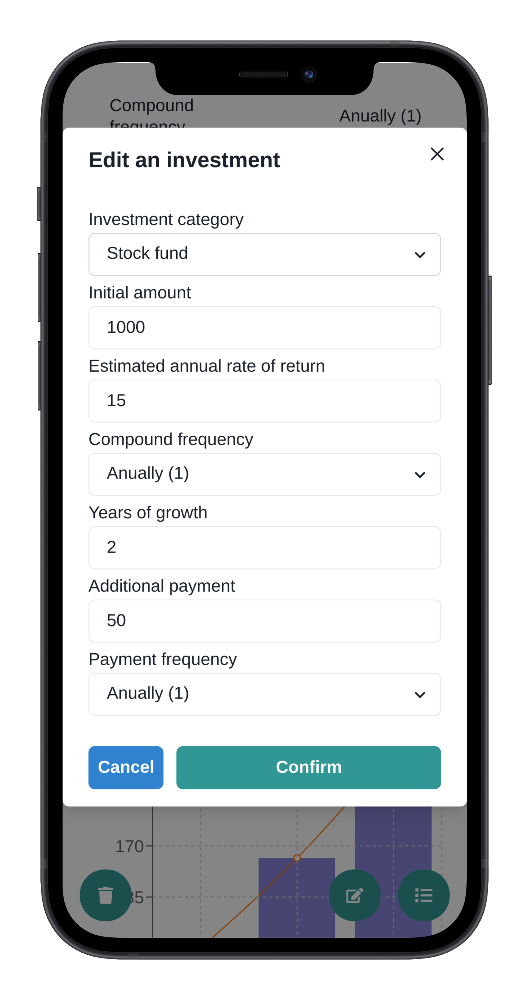

[](https://codecov.io/gh/Nalhin/FinanceCalculator)
[](https://www.codefactor.io/repository/github/nalhin/financecalculator)
[](https://sonarcloud.io/dashboard?id=FinanceCalculator_frontend)
[](https://sonarcloud.io/dashboard?id=FinanceCalculator_backend)
[](LICENSE.md)

# Finance Calculator

Finance calculator with investment planning, visualization and persistence.

## Table of contents

* [Description](#description)
* [Features](#features)
* [Presentation](#presentation)
* [REST API specification](#rest-api-specification)
* [Architecture](#architecture)
* [Prerequisites](#prerequisites)
* [Installation](#installation)
* [Tests](#tests)
* [License](#license)

## Description

The business logic is based on economic compound interest rate formulas.

## Features

* Modular full-stack application
* Advanced interactive visualization
* Compound interest rate math formulas implementation
* Performant and scalable persistence
* Authentication and authorization
* Fully responsive mobile first design

## Presentation

### Mobile

<p align="center">
  <a href="https://youtu.be/noUTVgs8gUI">
    
  </a>
</p>

### Desktop

<p align="center">
  <a href="https://youtu.be/WaprKZioiMg">
    
  </a>
</p>

### Screens

#### Landing Page

<p align="center">
    
</p>

#### Calculator

<p align="center">
    
</p>

#### Investment summary

<p align="center">
    
</p>

#### Investment distribution

<p align="center">
    
</p>

#### Investments

<p align="center">
    
</p>

#### Edit investment

<p align="center">
    
</p>

## Technology Stack

### Frontend

* TypeScript
* React
* Chakra UI
* React Query
* React Router
* Recharts
* React Hook Form
* React Testing Library
* Jest
* MSW

### Backend

* Java 11
* Spring (web, data, security)
* Groovy
* Spock
* Flyway
* Mapstruct
* Testcontainers
* REST-assured
* Springfox
* Maven

### CI/CD

* Github Actions
* Codecov
* SonarCloud

## Architecture

## REST API specification

Swagger API specification is available at [http://localhost:8080/swagger-ui/](http://localhost:8080/swagger-ui/). The
server has to be up and running in for the documentation to be available

## Prerequisites

### Frontend

Install (node)[https://nodejs.org/en], (npm)[https://www.npmjs.com]  and [yarn](https://yarnpkg.com). You should be able
to run the following commands.

```bash
node --version
npm --version
yarn --version
```

### Backend

Install [jdk11](https://www.oracle.com/java/technologies/javase-jdk11-downloads.html)
and [maven](https://maven.apache.org/).

You should be able to run the following commands.

```bash
java --version
mvn --version
```

Install [docker](https://docs.docker.com/install/) and [docker-compose](https://docs.docker.com/compose/). You should be
able to run the following commands.

```bash
docker --version
docker-compose --version
```

## Installation

Run the following commands before proceeding to the sections below.

```bash
docker-compose up -d
```

### Frontend

```bash
cd frontend
yarn install
yarn run start
```

### Backend

```bash
cd backend
mvn spring-boot:run
```

## Tests

In order to manually run tests, follow the instructions below.

### Frontend

```bash
yarn run test
```

### Backend

```bash
mvn verify
```

## License

This project is licensed under the MIT License - see the [LICENSE.md](LICENSE.md) file for details.
