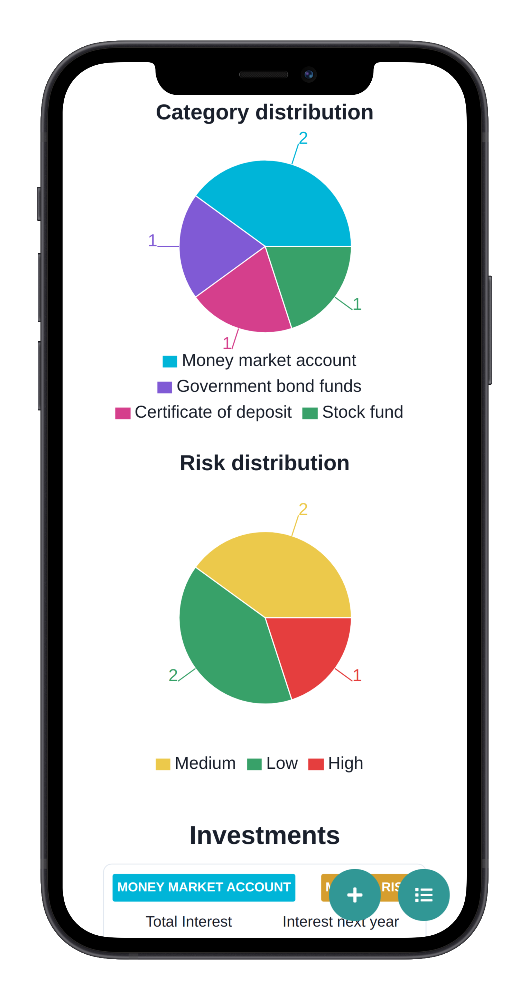

[](https://codecov.io/gh/Nalhin/FinanceCalculator)
[](https://www.codefactor.io/repository/github/nalhin/financecalculator)
[](https://sonarcloud.io/dashboard?id=FinanceCalculator_frontend)
[](https://sonarcloud.io/dashboard?id=FinanceCalculator_backend)
[](LICENSE.md)

# Finance Calculator

Finance calculator with investment planning, interactive visualization and persistence.

## Table of contents

* [Description](#description)
* [Features](#features)
* [Presentation](#presentation)
* [Architecture](#architecture)
* [REST API specification](#rest-api-specification)
* [Prerequisites](#prerequisites)
* [Installation](#installation)
* [Tests](#tests)
* [License](#license)

## Description

Finance Calculator provides its users with robust and fault-tolerant investment planning tools. Upon visiting the
website, the user can utilize our investment calculator to plan a real-time investment. The user can then decide to
create an account to generate investment baskets - groups consisting of multiple assets. The application provides a full
overview of the whole basket and gives much-needed insights. Interactive and responsive charts enhance user experience
and provide intuitive visualization tools. Investment statistics are calculated based on economic compound interest
formulas (the implementation was tested and compared against real data). Due to the confidential nature, the users
cannot interact with investments and baskets that they do not own directly. The website follows a modern, fully
responsive mobile-first design approach.

## Features

* Modular full-stack application
* Advanced interactive visualization
* Compound interest rate economic formulas implementation
* Performant and scalable persistence layer
* Authentication and authorization
* Fully responsive mobile-first design

## Presentation

### Mobile

<p align="center">
  <a href="https://youtu.be/noUTVgs8gUI">
    
  </a>
</p>

### Desktop

<p align="center">
  <a href="https://youtu.be/WaprKZioiMg">
    
  </a>
</p>

### Landing Page

<p align="center">
    
</p>

### Calculator

<p align="center">
    
</p>

### Investment summary

<p align="center">
    
</p>

### Investment distribution

<p align="center">
    
</p>

### Investments

<p align="center">
    
</p>

### Edit investment

<p align="center">
    
</p>

## Technology Stack

### Frontend

* TypeScript
* React
* Chakra UI
* React Query
* React Router
* Recharts
* React Hook Form
* React Testing Library
* Jest
* MSW

### Backend

* Java 11
* Spring (Web, Data, Security)
* Hibernate
* Groovy
* Spock
* PostgreSQL
* Flyway
* MapStruct
* Testcontainers
* REST-assured
* Springfox
* Maven

### CI/CD

* Github Actions
* Codecov
* SonarCloud

## Architecture

### Frontend

Frontend architecture follows modern React trends. React context and React Query is used instead of the global state
libraries such as Redux. Such a design decision reduces clutter and allows the application to be tested with mock REST
API server making the tests more reliable and robust.

```
src
├── core (communication with backend)
├── pages (routes with page specific components)
└── shared (shared elements)
    ├── components (reusable components - used in more than one place)
    ├── constants (hard coded constants and translations)
    ├── context (react context providers and hooks)
    ├── models (classes that encapsulate business logic)
    ├── types (TypeScript types)
    └── utils (reusable, pure functions)
```

### Backend

Backend application follows a feature-first module structure. Due to the CRUDish nature of the project, database model
representation is coupled with its REST API counterparts. Unstable factors like time are abstracted to make the code
more testable.

```
root
├── core (configs, authentication and global error handlers)
├── common (reusable functionality)
└── feature modules 
    ├── dto (data transfer objects)
    ├── exception (domain exceptions)
    ├── Entity (database entity - table)
    ├── Controller (communication layer)
    ├── Mapper (mappings between entity and dto)
    ├── Repository (data access layer)
    └── Service (business logic)
```

## REST API specification

Swagger API specification is available at [http://localhost:8080/swagger-ui/](http://localhost:8080/swagger-ui/). The
server has to be up and running in for the documentation to be available

## Prerequisites

### Frontend

Install (node)[https://nodejs.org/en], (npm)[https://www.npmjs.com]  and [yarn](https://yarnpkg.com). You should be able
to run the following commands.

```bash
node --version
npm --version
yarn --version
```

### Backend

Install [jdk11](https://www.oracle.com/java/technologies/javase-jdk11-downloads.html)
and [maven](https://maven.apache.org/).

You should be able to run the following commands.

```bash
java --version
mvn --version
```

Install [docker](https://docs.docker.com/install/) and [docker-compose](https://docs.docker.com/compose/). You should be
able to run the following commands.

```bash
docker --version
docker-compose --version
```

## Installation

Run the following commands before proceeding to the sections below.

```bash
cd docker
docker-compose up -d
```

### Frontend

```bash
cd frontend
yarn install
yarn run start
```

### Backend

```bash
cd backend
mvn spring-boot:run
```

## Tests

In order to manually run tests, follow the instructions below.

### Frontend

```bash
yarn run test
```

### Backend

```bash
mvn verify
```

## License

This project is licensed under the MIT License - see the [LICENSE.md](LICENSE.md) file for details.
